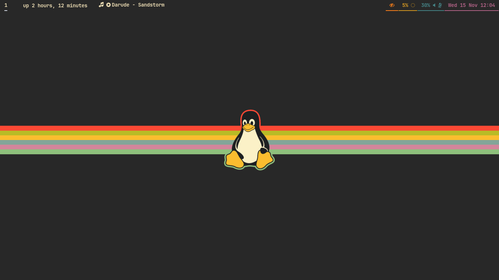

<h1 align="center"><code>~/.dotfiles</code></h1>
<h6 align="center"><i>my personal configuration files for GNU/Linux workstations!</i></h6>

# Current in-use (Wayland) tools
- 🐧 **OS**: btw i use [Arch Linux](https://archlinux.org)
- 🌱 **WM**: [Sway](dot-config/sway)
- 🍫 **Bar**: [Waybar](dot-config/waybar)
- 🐚 **Shell**: [Zsh](dot-config/zsh)
- 🚀 **Launcher**: [Rofi](dot-config/rofi)
- 👣 **Terminal emulator**: [Foot](dot-config/foot)
- ✏️ **Text editor**: [Neovim](dot-config/nvim), [GNU/Emacs](dot-config/emacs) & [Doom Emacs](dot-config/doom)
- 🎨 **Colorscheme**: [Gruvbox](https://github.com/morhetz/gruvbox)
    - GTK4: [Gruvbox GTK Theme](https://github.com/Fausto-Korpsvart/Gruvbox-GTK-Theme)
    - GTK3: [gruvbox-material-gtk](https://github.com/TheGreatMcPain/gruvbox-material-gtk)
    - Chrome: [gruvbox-slate](https://chromewebstore.google.com/detail/gruvbox-slate/giokfhncgfjkoamdbhfhfhgpikaioccc)
    - Telegram: [telegram-gruvbox](https://github.com/shvedes/telegram-gruvbox)
-  🖼️ **Wallpapers Collections**:
    - Gruvin': [shvedes](https://github.com/shvedes/dotfiles/tree/d86ef8a25f7f2fd5cad01633c89eba1b5356d4b0/src/Wallpapers)
    - Elementary: [elementary](https://github.com/elementary/wallpapers)
    - NASA's Image of the day: [archive](https://www.nasa.gov/image-of-the-day/)

*and more!*

# Setup
TODO. Use GNU/Stow

## Take a look!

